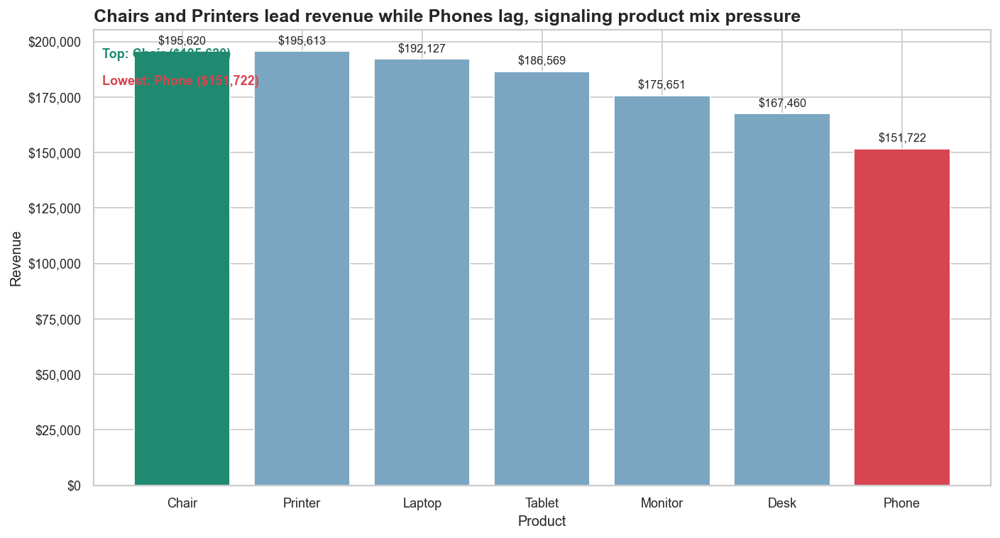
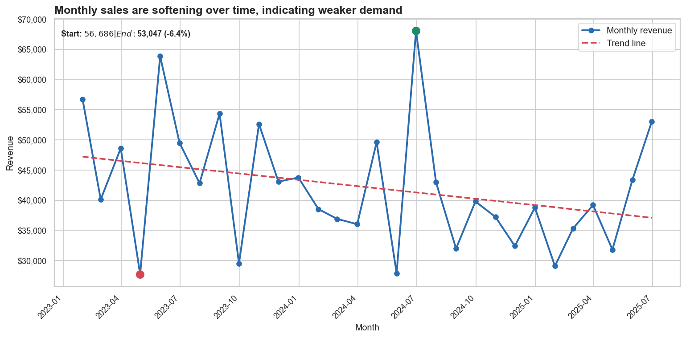
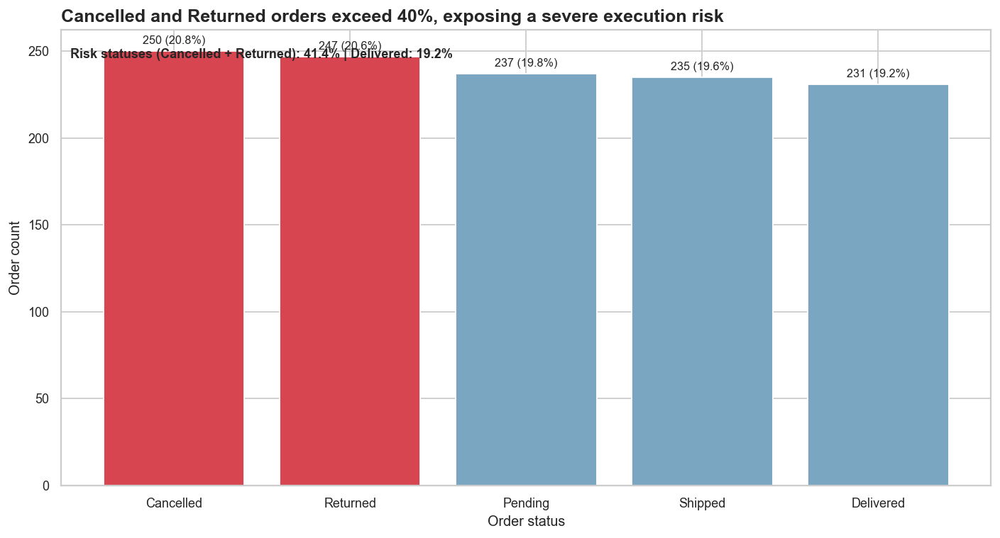
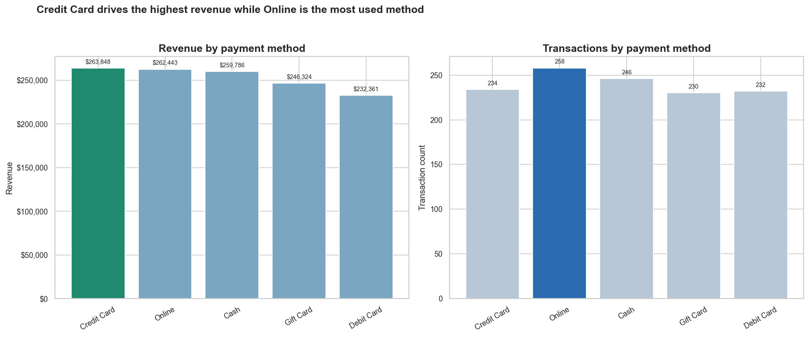
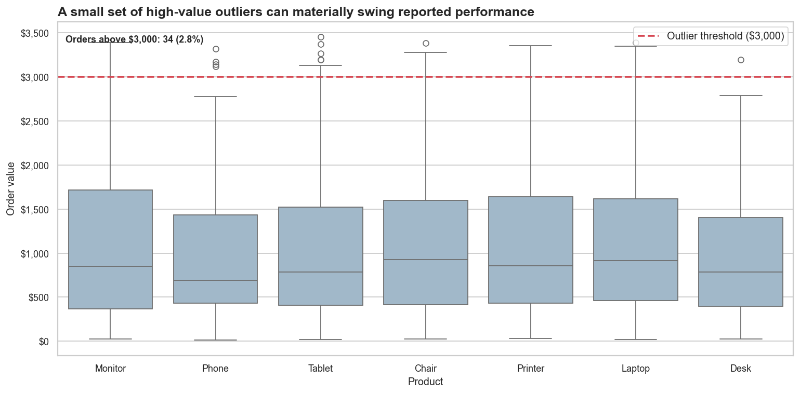

# Project 4: Insight to Visual Storytelling (Sales)

This project turns analysis outputs into a manager-friendly business story.

Instead of stopping at technical findings, it follows a clear flow:

Insight -> Visualization -> Actionable Story

## Objective

Convert cleaned transaction data and SQL insights into a decision-ready narrative using the right chart types, highlighted findings, and SCR storytelling (Situation, Complication, Resolution).

## Inputs

- `data/cleaned/cleanedEDA.csv`: cleaned dataset used for all visual analyses
- `reports/sql_insights_summary.txt`: SQL findings from the previous project phase

## Why These Steps Were Done

1. Data loading and type checks
Reason: Ensure dates and monetary values are analysis-ready before plotting trends or aggregations.

2. Product revenue aggregation (bar chart)
Reason: Bar charts are the best way to compare categories side by side and quickly identify top and low performers.

3. Monthly sales trend (line chart + trend line)
Reason: A line chart is the correct choice for time series because it reveals directional movement and volatility.

4. Order status distribution (bar chart)
Reason: Status counts are categorical comparisons; bar charts make risk-heavy statuses immediately visible.

5. Payment analysis (dual bar charts)
Reason: One chart answers "which method generates revenue?" and the other answers "which method is most used?".

6. Outlier analysis (boxplot)
Reason: Boxplots reveal spread, medians, and extreme orders that can distort monthly performance.

7. SCR storytelling report generation
Reason: Executives need interpretation and action, not just charts. SCR translates findings into decisions.

## Chart Selection Logic

| Business Question | Chart Type | Why |
|---|---|---|
| Which products generate more revenue? | Bar chart | Best for category comparison |
| Are sales increasing or decreasing over time? | Line chart | Best for trends over time |
| Which order statuses are risky? | Bar chart | Best for categorical frequency |
| Which payment methods drive value vs usage? | Bar chart (two panels) | Direct comparison across categories |
| Are there extreme order values? | Boxplot | Best for outlier and spread detection |

## Key Findings

- Chairs and Printers are revenue leaders, while Phones underperform.
- Monthly revenue shows a negative direction over the analysis period.
- Cancelled + Returned orders are above 40%, creating a major execution risk.
- Credit Card generates the most revenue, while Online is the most used method.
- High-value outliers exist and should be tracked separately.

## So What (Business Actions)

1. Reduce cancellation and return rates through root-cause analysis by product and referral source.
2. Recover demand with campaigns in weak months and bundle strategies around high-performing products.
3. Track fulfillment KPIs weekly with clear operational ownership.
4. Optimize payment incentives to improve high-value transaction mix.
5. Monitor high-value outliers as a separate performance segment.

## Project Structure

- `data/cleaned/cleanedEDA.csv` -> cleaned dataset
- `src/project4_visual_story.py` -> chart and story generation pipeline
- `reports/sql_insights_summary.txt` -> imported SQL insight report
- `reports/project4_story_report.txt` -> SCR-based business story output
- `reports/figures/*.png` -> generated visuals for submission and presentation
- `requirements.txt` -> project dependencies

## Run

From repository root:

```bash
python projects/project4-visual-storytelling-sales/src/project4_visual_story.py
```

## Visual Outputs

### 1) Product Revenue



### 2) Monthly Sales Trend



### 3) Order Status Risk



### 4) Payment Method Analysis



### 5) Outlier Distribution


